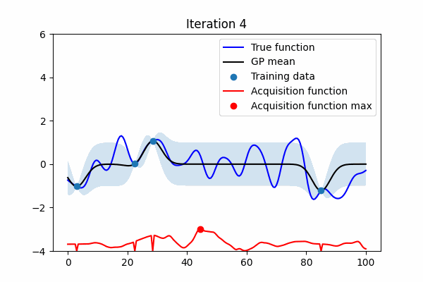

# Variational Entropy Search is Just 1D Regression

Building on this ICML 2025 spotlight paper: [A Unified Framework for Entropy Search and
Expected Improvement in Bayesian Optimization](https://arxiv.org/pdf/2501.18756)

Collections of toy expertiments for approximating Max Value entropy Search with variational methods. This simply boils down to fitting a 1D regression model for each and measuring the loss function, the x location with lowest loss is chosen for black box evaluation.

This code is purely for running toy experiments for the researtch paper "Variational Entropy Search is Just 1D Regression"


# Setup
```
# install uv first
https://docs.astral.sh/uv/getting-started/installation/

# install the other dependencies
uv venv
uv pip install -e .
uv run pytest
```

# Usage
You can run an experiment using these commands
```
cd scripts
python make_1d_benchmark_funs.py  # makes a set of 1D GP sample functions for BO testing 
python make_1d_bo_animation.py            # applies BO method, and parses the resuls into an animation
```

